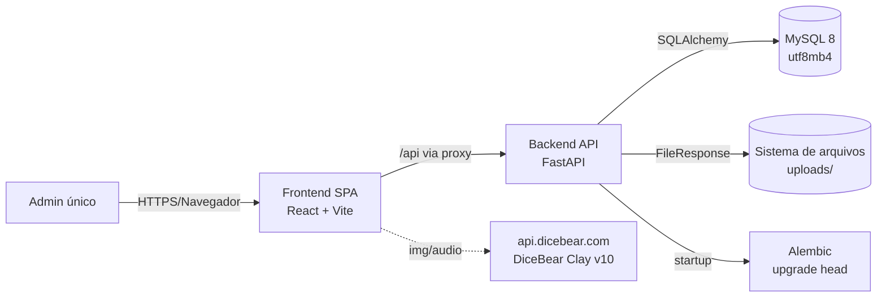
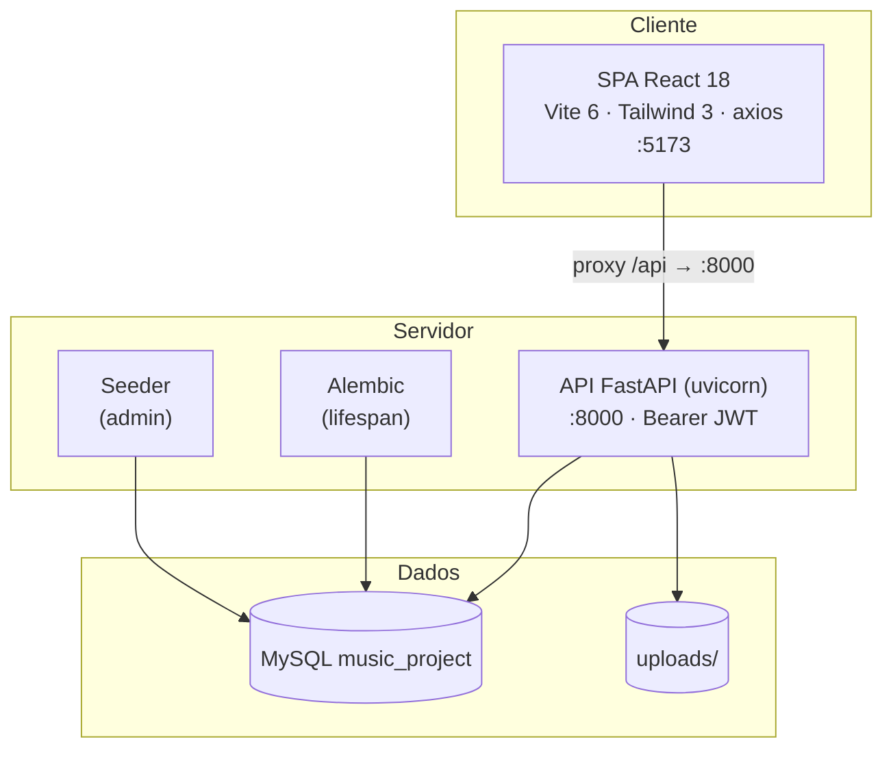
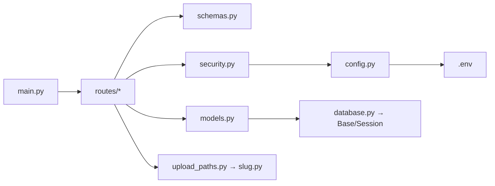
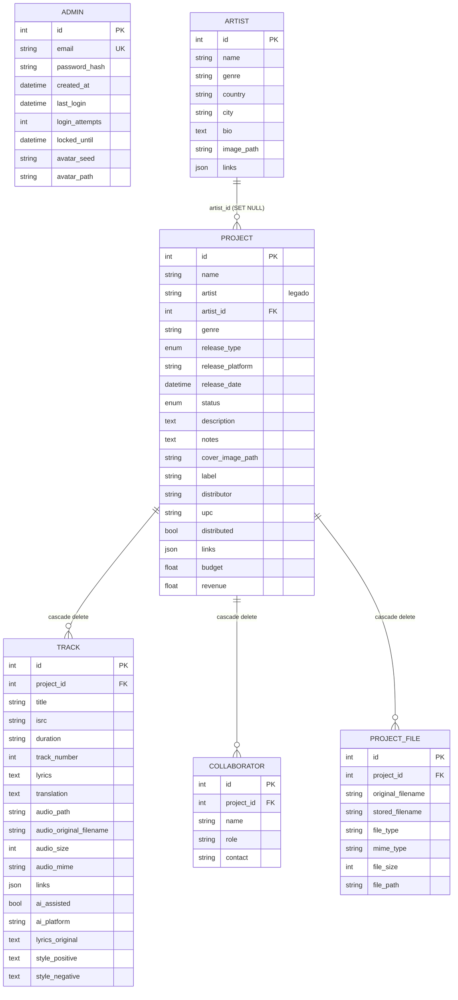

# SDD — Software Design Document

**Projeto:** Music Project Manager
**Versão do documento:** 1.0
**Status:** Vigente (as-built)
**Stack:** FastAPI · React · MySQL · Alembic
**Público-alvo:** desenvolvedores humanos e agentes de IA que evoluem este repositório

---

## 1. Visão geral

O **Music Project Manager** é um sistema web de uso pessoal (single-tenant, admin único) para
registrar e gerenciar projetos musicais: artistas, lançamentos (álbuns, EPs e singles),
faixas, catálogo (ISRC/UPC), finanças, colaboradores, arquivos e links de distribuição.

O sistema **não é** um editor de áudio/DAW, nem uma rede social, nem uma ferramenta
multiusuário. É um **catálogo técnico autenticado**: todo dado e todo arquivo (capas, fotos,
MP3, documentos) é privado e só acessível com autenticação.

### 1.1 Objetivos de design

| Objetivo | Como é atendido |
|---|---|
| Registro completo e durável por projeto | Modelo relacional normalizado + migrações Alembic |
| Privacidade de mídia | Arquivos nunca servidos estaticamente; sempre via rota autenticada |
| Operação simples local | `start.bat`, migrações automáticas no startup, admin auto-criado |
| Manutenibilidade por IA | Convenções explícitas, camadas claras, invariantes documentados neste SDD |
| UX consistente | Design system Tailwind + classes utilitárias e tema dual |

### 1.2 Escopo

**Dentro:** CRUD de artistas/projetos/faixas/colaboradores, upload e exibição protegida de
mídia, painel (dashboard) com busca/filtros, autenticação JWT e gestão de conta do admin.

**Fora:** multiusuário/equipes, streaming público, processamento de áudio, integração com
APIs de distribuição, pagamentos, hospedagem em nuvem (hoje é dev local em `localhost`).

---

## 2. Arquitetura

### 2.1 Diagrama de contexto (C4 — nível 1)



### 2.2 Diagrama de containers (C4 — nível 2)



### 2.3 Estilo arquitetural

- **Backend:** monólito em camadas (Router → Schema → Security → ORM → DB), síncrono
  (SQLAlchemy + PyMySQL), com dependências injetadas pelo FastAPI (`Depends`).
- **Frontend:** SPA em componentes, roteamento declarativo (`react-router-dom`), estado
  local por página, cliente HTTP central (`services/api.js`). Sem store global (Redux/Zustand).
- **Integração:** a SPA nunca fala com o banco; consome exclusivamente a API REST.

---

## 3. Stack tecnológica

### 3.1 Backend

| Item | Versão | Uso |
|---|---|---|
| Python | 3.10+ (dev em 3.13) | Runtime |
| FastAPI | 0.115.6 | Framework HTTP e OpenAPI/Swagger |
| Uvicorn | 0.34.0 | Servidor ASGI |
| SQLAlchemy | 2.0.36 | ORM |
| PyMySQL | 1.1.1 | Driver MySQL |
| Pydantic | 2.10.4 | Validação/serialização |
| python-jose[cryptography] | 3.3.0 | JWT (HS256) |
| passlib[bcrypt] / bcrypt | 1.7.4 / 4.2.1 | Hash de senha |
| python-multipart | 0.0.20 | Uploads multipart |
| python-dotenv | 1.0.1 | Config por `.env` |
| slowapi | 0.1.9 | Declarado (rate limit efetivo é custom — ver §8) |
| Alembic | 1.19.2 | Migrações de schema |

### 3.2 Frontend

| Item | Versão | Uso |
|---|---|---|
| React | 18.3 | UI |
| Vite | 6.x | Build/dev server + proxy |
| React Router DOM | 6.28 | Rotas |
| Tailwind CSS | 3.4 (`darkMode: 'class'`) | Estilo |
| axios | 1.7 | HTTP |
| react-markdown + remark-gfm | 10.x / 4.x | Renderização de Markdown |

### 3.3 Dados e infra

- **MySQL 8+** com `utf8mb4`/`utf8mb4_unicode_ci`.
- **Alembic** como fonte de verdade do schema (sem `create_all`).
- **Sistema de arquivos local** para `uploads/` (não versionado no Git).
- Ambiente de desenvolvimento **Windows + localhost**; `start.bat` sobe tudo.

---

## 4. Backend — arquitetura interna

### 4.1 Fluxo de dependências



### 4.2 Bootstrap da aplicação (`main.py`)

O `lifespan` executa, em ordem, **antes** de a API aceitar requisições:

1. `run_migrations()` — instancia `alembic.config.Config` e roda `command.upgrade(cfg, "head")`.
2. `init_admin(db)` — cria/sincroniza o admin único (ver §7).

Também são registrados:
- **CORS** (`settings.CORS_ORIGINS`; `*` em desenvolvimento, `allow_credentials=False`).
- **Middleware de headers de segurança**: `X-Content-Type-Options: nosniff`,
  `X-Frame-Options: DENY`, `Referrer-Policy: no-referrer`.
- **Handler** de `HTTPException` → JSON `{"detail": ...}`.
- **`GET /api/health`** → `{status, name, version}`.
- Inclusão dos routers `auth, projects, tracks, collaborators, uploads, artists`.

### 4.3 Responsabilidade dos módulos

| Arquivo | Responsabilidade |
|---|---|
| `main.py` | App, lifespan (migrações + seed), middlewares, health |
| `config.py` | `Settings` carregado do `.env` (singleton `settings`) |
| `database.py` | `engine`, `SessionLocal`, `Base`, dependency `get_db` |
| `models.py` | ORM: `Admin`, `Artist`, `Project`, `Track`, `Collaborator`, `ProjectFile` |
| `schemas.py` | Contratos Pydantic de entrada/saída |
| `security.py` | Hash/senha, JWT, `get_current_admin` |
| `seeder.py` | `init_admin`, `finalize_login` |
| `slug.py` | Normalização de nomes legíveis (seguros) |
| `upload_paths.py` | Convenção de pastas de upload |
| `routes/*.py` | Endpoints HTTP por recurso |

### 4.4 Padrão de rota

- Prefixo de recurso + `tags` + `dependencies=[Depends(get_current_admin)]` no nível do
  router (protege **todas** as rotas daquele recurso de uma vez).
- Helper `_check_project`/`_load_*` valida existência e dispara `404`.
- Listagens usam `selectinload` para evitar N+1.
- Atualizações parciais usam `model_dump(exclude_unset=True)` + `setattr`.
- Delete protegido por FK com `cascade`/`ON DELETE` definido no modelo.

---

## 5. Modelo de dados

### 5.1 Diagrama entidade-relacionamento



### 5.2 Enums de domínio

```python
ProjectStatus = planejamento | producao | mixagem | masterizacao | lancado | pausado
ReleaseType   = album | ep | single
```

> Importante: as colunas usam `sqlalchemy.Enum`, portanto o banco armazena o **nome** do
> membro do Enum. Alterar valores existentes exige migração de dados, não só de schema.

### 5.3 Detalhes relevantes

- **Admin único:** tabela `admin` guarda no máximo 1 registro (`id` default 1). Não há
  vínculo de propriedade por projeto — qualquer token válido acessa tudo.
- **`Project.artist` (string) é legado/compatibilidade**; o vínculo real é `artist_id` →
  `artists.id` com `ondelete="SET NULL"` (excluir artista não apaga projetos, apenas desvincula).
- **`Project.tracks_count`** é `@property` (contagem em memória dos relacionamentos carregados),
  usado em `ProjectRef`/`ArtistResponse`.
- **`Track` e `ProjectFile`** guardam caminho **relativo** a `UPLOAD_DIR` (nunca absoluto).
- **`ProjectFile.stored_filename`** hoje recebe o nome **legível** (slug + sufixo de colisão),
  apesar do comentário histórico "UUID" no modelo. O comportamento efetivo é o de `uploads.py`.
- Relacionamentos de `Project` (`tracks`, `collaborators`, `files`) usam
  `cascade="all, delete-orphan"` — excluir o projeto remove filhos no ORM.

---

## 6. Contratos da API

### 6.1 Convenções

- Base local: `http://localhost:8000` (frontend usa proxy `/api`).
- Autenticação: `Authorization: Bearer <jwt>` em **todas** as rotas, exceto
  `POST /api/auth/login`, `POST /api/auth/logout` e `GET /api/health`.
- Erros: `{"detail": "mensagem"}` com o status apropriado.
- Datas em ISO-8601 (UTC, `datetime.utcnow`).
- Swagger: `GET /docs`.

### 6.2 Autenticação e conta — `/api/auth`

| Método | Rota | Corpo | Resposta | Protegida |
|---|---|---|---|---|
| POST | `/login` | `LoginRequest {email, password}` | `{token, message}` | não |
| POST | `/logout` | — | `{message}` | não |
| GET | `/me` | — | `AdminMe` | sim |
| PUT | `/email` | `{email, password}` | `AdminMe` | sim |
| PUT | `/password` | `{current_password, new_password}` | `{message}` | sim |
| PUT | `/avatar` | `{avatar_seed?}` | `AdminMe` | sim |
| POST | `/avatar` | `multipart file` | `AdminMe` | sim |
| GET | `/avatar` | — | imagem (inline) | sim |

### 6.3 Projetos — `/api/projects`

| Método | Rota | Descrição |
|---|---|---|
| GET | `` | Lista; query `status_filter`, `genre`, `search` (ilike nome/artista/gênero) |
| POST | `` | Cria (201) |
| GET | `/{id}` | Detalhe com relacionamentos |
| PUT | `/{id}` | Atualização parcial |
| DELETE | `/{id}` | Exclui (204) |
| POST | `/{id}/cover` | Upload de capa (imagem ≤ 10MB) |
| GET | `/{id}/cover` | Exibe capa (inline, autenticado) |

### 6.4 Faixas — `/api/projects/{project_id}/tracks`

| Método | Rota | Descrição |
|---|---|---|
| GET | `` | Lista ordenada por `track_number` |
| POST | `` | Cria (201) |
| PUT | `/{track_id}` | Atualização parcial (inclui campos de criação com IA) |
| DELETE | `/{track_id}` | Exclui + remove áudio físico (204) |
| POST | `/{track_id}/audio` | Upload do MP3 (sem limite de tamanho; valida extensão) |
| GET | `/{track_id}/audio` | Playback protegido (inline) |
| DELETE | `/{track_id}/audio` | Remove áudio |

> O campo `links` da faixa guarda `{lyrics_url, clip, streaming_url, ...}`. Os campos de
> criação com IA (`ai_assisted`, `ai_platform`, `lyrics_original`, `style_positive`,
> `style_negative`) trafegam no corpo da própria faixa e aparecem no modal de visualização
> (aba Infos). O `style_positive` faz o papel do prompt usado.

### 6.5 Colaboradores — `/api/projects/{project_id}/collaborators`

`GET` · `POST` · `PUT /{collaborator_id}` · `DELETE /{collaborator_id}`

### 6.6 Arquivos — `/api/projects/{project_id}/files`

| Método | Rota | Descrição |
|---|---|---|
| GET | `` | Lista arquivos do projeto |
| POST | `` | Upload (áudio/imagem/documento ≤ 50MB) |
| GET | `/{file_id}/download` | Download forçado (`attachment`) |
| DELETE | `/{file_id}` | Exclui registro + arquivo físico |

### 6.7 Artistas — `/api/artists`

| Método | Rota | Descrição |
|---|---|---|
| GET | `` | Lista com projetos e `tracks_count` |
| POST | `` | Cria (201) |
| GET/PUT/DELETE | `/{id}` | Detalhe / atualização / exclusão |
| POST | `/{id}/image` | Upload de foto (imagem ≤ 10MB) |
| GET | `/{id}/image` | Exibe foto (inline, autenticada) |

### 6.8 Health

`GET /api/health` → `{"status": "ok", "name": "Music Project Manager", "version": "1.0.0"}`

---

## 7. Autenticação e gestão do admin

### 7.1 JWT

- Algoritmo **HS256**; `SECRET_KEY` do `.env`; expiração padrão **1440 min (24h)**.
- Payload: `{"sub": "admin", "exp": <utc>}`. O subject é **fixo** (`"admin"`), pois há um
  único operador.
- `get_current_admin` valida o Bearer e retorna uma instância vazia `Admin()` — **não**
  consulta o banco. Ou seja: **o token é a única prova de identidade** nas rotas.

### 7.2 Bootstrap/sincronização do admin (`seeder.py`)

| Cenário | Comportamento |
|---|---|
| Sem admin e sem `ADMIN_PASSWORD` | Gera senha forte aleatória e a imprime **uma vez** no console |
| Sem admin e com `ADMIN_PASSWORD` | Cria admin com a senha do `.env` |
| Admin existe e `ADMIN_PASSWORD` definido | **Sincroniza** e-mail + senha a cada startup, zera bloqueios |
| Admin existe e sem `ADMIN_PASSWORD` | Nada é alterado |

`finalize_login` registra `last_login` e zera `login_attempts`/`locked_until`.

### 7.3 Rate limiting de login

Há **duas** camadas:

1. **Em memória, por IP** (`_login_attempts` em `routes/auth.py`): bloqueia após **5 falhas
   em 5 min**; sucesso limpa o histórico do IP. Como é em memória, não é compartilhado entre
   workers/processos.
2. **No banco** (`Admin.login_attempts` + `locked_until`): após 5 falhas, a conta é
   bloqueada por 5 minutos.

> `slowapi` está nas dependências, mas o rate limit efetivo de login é o custom acima.

### 7.4 Gestão de conta

- **E-mail:** exige senha atual; normaliza para minúsculas; valida formato e unicidade.
- **Senha:** mínimo 8 caracteres, diferente da atual; ao trocar, zera bloqueios.
- **Avatar:** duas modalidades mutuamente exclusivas —
  - **Pré-definido:** `avatar_seed` (DiceBear Clay).
  - **Imagem enviada:** `avatar_path` (arquivo em `uploads/admins/`).
  Definir um apaga o outro (o arquivo físico antigo é removido).

---

## 8. Segurança

### 8.1 Invariantes (NUNCA quebrar)

1. **Nenhum arquivo de `uploads/` é servido estaticamente.** Todo acesso de mídia passa por
   rota autenticada (`get_current_admin`) e por `FileResponse`.
2. **Toda rota de dados exige Bearer JWT** (proteção no nível do router).
3. **Caminhos de arquivo são sempre relativos a `UPLOAD_DIR`** e sanitizados por `slugify`.
4. **Segredos nunca no código**: `SECRET_KEY` e credenciais vêm do `.env` (não versionado).
5. **Uploads validados** por extensão permitida, conteúdo não-vazio e tamanho máximo.

### 8.2 Controles implementados

| Controle | Implementação |
|---|---|
| Hash de senha | bcrypt via passlib |
| Autenticação | JWT HS256 + `HTTPBearer` |
| Rate limit de login | Duas camadas (IP em memória + conta no banco) |
| CORS | Restringível por `CORS_ORIGINS` |
| Headers | `nosniff`, `DENY`, `no-referrer` |
| Anti path-traversal | `slugify` (remove acentos, `[^a-z0-9] → _`) + caminho relativo |
| Validação de upload | Extensões por categoria; ≤ 10MB imagens; ≤ 50MB arquivos gerais |
| Separação de mídia | Blob via token no cliente (Object URL) — `img`/`audio` não enviam header sozinhos |

### 8.3 Limitações conhecidas (revisar antes de expor publicamente)

- `SECRET_KEY` default insegura se o `.env` não for configurado.
- `CORS_ORIGINS=*` por padrão em dev; **restrinja em produção**.
- Token em `localStorage` (vulnerável a XSS; não há CSP definida).
- Rate limit em memória não funciona com múltiplos workers.
- `get_current_admin` não consulta o banco: um token válido permanece válido até expirar,
  mesmo que a senha/e-mail mudem.
- Sem paginação nas listagens.
- `ondelete="CASCADE"` dos filhos depende de o banco honrar a FK (InnoDB honra); o ORM também
  remove por `cascade`, então há dupla garantia.

---

## 9. Sistema de arquivos (`uploads/`)

### 9.1 Convenção de diretórios

```text
uploads/
├── admins/
│   └── avatar.<ext>
└── <artista>/                          # slug do artista (ou "sem_artista")
    ├── foto.<ext>
    └── <album>/                        # slug do projeto
        ├── capa.<ext>
        ├── 01_titulo_da_faixa.mp3      # <nº com 2 dígitos>_<título slug>
        └── contrato_distribuicao.pdf   # arquivo: <nome slug><ext>, colisão → _1, _2
```

### 9.2 Regras

- Nomes **legíveis**, minúsculos, sem acentos; espaços e símbolos → `_` (`slug.py`).
- Prioridade do artista: `artist_ref.name` → `artist` (texto) → `sem_artista`.
- Colisão de nome de arquivo: sufixo `_1`, `_2`, ...
- Áudio de faixa sobrescreve o anterior (`_remove_audio_file`).
- `uploads/` é **ignorado pelo Git** (exceto `.gitkeep`).

---

## 10. Frontend

### 10.1 Roteamento (`App.jsx`)

```text
/login                      → Login (público)
/                           → Protected > Layout
    index                   → Dashboard
    conta                   → Account
    projects/:id            → ProjectDetail
    artists                 → Artists
    artists/:id             → ArtistDetail
*                           → redirect /
```

`Protected` verifica a presença de `token` em `localStorage`; ausente → `/login`.

### 10.2 Estrutura de componentes

```text
src/
├── pages/                  # Login, Dashboard, ProjectDetail, Artists, ArtistDetail, Account
├── components/
│   ├── Layout/             # Layout, Navbar, Sidebar, ThemeToggle
│   ├── Projects/           # ProjectCard, ProjectForm
│   ├── Artists/            # ArtistForm
│   └── UI/                 # Modal, SecureImage, TrackAudio, TrackLyrics,
│                           # StatusBadge, Markdown
└── services/api.js         # axios + interceptors
```

### 10.3 Cliente HTTP (`services/api.js`)

- `baseURL: '/api'` (proxy do Vite → `:8000`).
- **Request interceptor:** injeta `Authorization: Bearer <token>`.
- **Response interceptor:** em `401`, remove o token e redireciona para `/login`.

### 10.4 Mídia autenticada

Tags nativas `img`/`audio` não enviam o header Bearer. Por isso:

- `SecureImage` e `TrackAudio` buscam o recurso como **blob** via `api.get(src, {responseType:'blob'})`,
  criam um `Object URL` (`URL.createObjectURL`) e o usam no elemento.
- O `Object URL` é revogado (`URL.revokeObjectURL`) na desmontagem/troca de `src`.
- `SecureImage` cai num placeholder quando não há imagem ou quando falha.

### 10.5 Tema

- `darkMode: 'class'`; `ThemeToggle` alterna a classe `dark` no `<html>` e persiste em
  `localStorage['theme']` (padrão **dark**).
- Tokens de cor em `tailwind.config.js` (`dark-*`, `light-*`, `accent-*`).

### 10.6 Design system (`index.css`)

Classes utilitárias reutilizáveis: `.btn`, `.btn-primary/secondary/danger/ghost`, `.input`,
`.label`, `.card`, `.modal-overlay`, `.modal-content`, `.markdown-body` (com variantes de
tipografia), além de scrollbars temáticas e correção de autofill.

### 10.7 Markdown

- `Markdown` (ReactMarkdown + GFM) para textos descritivos (bio, "sobre o álbum", notas).
- `InlineMarkdown` renderiza marcação inline **linha a linha**, preservando o alinhamento
  EN|PT da letra (`**negrito**`, `*itálico*`, `` `código` ``, `[link](url)`), com escape de HTML.

### 10.8 Comunicação entre componentes (sem store global)

- `window` CustomEvent `project-search`: a Navbar emite a busca; a Dashboard escuta e filtra.
- `window` CustomEvent `admin-profile-updated`: a página Account notifica a Navbar a
  recarregar `/auth/me` (atualização de avatar em tempo real).

### 10.9 Convenções de UI/UX (atuais)

- **Responsividade:** tabelas viram **cards** abaixo do breakpoint `md` (768px); os cards
  trazem as mesmas ações das linhas.
- **Botões de ação com ícone:** ações rápidas usam botões **circulares** com ícone e
  `title`/`aria-label` (ex.: novo, detalhes, editar, excluir).
- **Avatar DiceBear Clay** usa a API **v10** (`https://api.dicebear.com/10.x/clay/svg`).

---

## 11. Migrações e evolução do schema

- O schema é versionado em `backend/alembic/versions/`; `alembic.ini` **não** contém
  credenciais (URL vem de `config.py`/`.env`).
- No startup, `main.py` roda `upgrade head` automaticamente.
- Revisões existentes (baseline + evoluções):

| Revisão | Tema |
|---|---|
| `d864774756fa` | Baseline do schema |
| `804cb7ff7022` | `projects.description` (sobre o álbum) |
| `9e7d2c4a1f83` | `projects.distributor` |
| `5b1e34d8feb5` | Áudio MP3 de faixas + links de distribuição |
| `ca50613ba645` | `tracks.translation` |
| `c4d8f9a10b2e` | `duration` como texto |
| `b3c7e2a9d1f4` | Avatar do admin |
| `77a1f242f30c` | Campos de criação com IA em `tracks` (`ai_assisted`, `ai_platform`, `lyrics_original`, `style_positive`, `style_negative`) |
| `be94876055a0` | Remove campo `prompt` de `tracks` (era o mesmo do estilo positivo) |

### Fluxo para alterar o schema

1. Editar `models.py` (e `schemas.py` se afetar contrato).
2. Rodar `alembic revision --autogenerate -m "descricao"` **dentro de `backend/`**.
3. Revisar o script gerado (autogenerate não detecta tudo).
4. `alembic upgrade head` (ou apenas reiniciar o backend).
5. Validar downgrade quando fizer sentido.

> Migrações já aplicadas são **históricas**: não editar retroativamente; criar uma nova.

---

## 12. Configuração e ambiente

### 12.1 Variáveis (`backend/.env`, base em `.env.example`)

| Variável | Default | Descrição |
|---|---|---|
| `ADMIN_EMAIL` | `admin@musicproject.com` | E-mail do admin |
| `ADMIN_PASSWORD` | vazio | Se definido, sincroniza credenciais a cada startup |
| `SECRET_KEY` | valor de dev | **Trocar em produção** |
| `ACCESS_TOKEN_EXPIRE_MINUTES` | `1440` | Expiração do JWT |
| `DB_HOST`/`DB_PORT`/`DB_USER`/`DB_PASSWORD`/`DB_NAME` | `localhost`/`3306`/`root`/``/`music_project` | Conexão MySQL |
| `UPLOAD_DIR` | `../uploads` | Raiz dos arquivos |
| `CORS_ORIGINS` | `*` | Origens permitidas (vírgula) |
| `LOGIN_RATE_LIMIT` | `5/minute` | Declarado (não usado pelo limiter custom) |

### 12.2 Banco

```sql
CREATE DATABASE music_project CHARACTER SET utf8mb4 COLLATE utf8mb4_unicode_ci;
```

### 12.3 Execução

```bash
# Backend
cd backend
python -m venv venv && venv\Scripts\activate
pip install -r requirements.txt
copy .env.example .env
python -m uvicorn main:app --reload --port 8000

# Frontend
cd frontend
npm install
npm run dev        # http://localhost:5173

# Atalho Windows (sobe os dois)
start.bat
```

---

## 13. Padrões de código e convenções

### 13.1 Idioma e nomenclatura

- **Comentários, mensagens de erro e UI em português** (sem acento em identificadores
  Python; com acento em textos de interface).
- Código Python: `snake_case` (funções/variáveis), `PascalCase` (classes).
- React: componentes `PascalCase`, arquivos `*.jsx`, hooks/estado em `camelCase`.
- Rotas da API: plural, `kebab`/`snake` conforme o recurso (`status_filter`, `release_type`).

### 13.2 Backend

- Cada recurso em seu arquivo de router, com `prefix`, `tags` e dependência de auth no router.
- Schemas: sufixos `Create`, `Update` (parcial), `Response`, `Base`.
- Não vazar ORM cru: respostas sempre por schema `Response` com `from_attributes=True`.
- Uploads: validar extensão → ler conteúdo → checar vazio/tamanho → remover antigo → gravar
  → persistir caminho **relativo**.

### 13.3 Frontend

- Páginas orquestram dados e chamadas `api`; componentes de UI são apresentacionais.
- Reutilizar classes de `index.css` (`.card`, `.input`, `.btn-*`) antes de criar estilos novos.
- Toda tela lista deve ter estado de carregando/vazio/erro e tratamento de `try/catch`.
- Breakpoints: mobile-first; tabela ≥ `md`; cards < `md`.

### 13.4 Git

- Conventional Commits em português, **sem acentos** no assunto. Ex.:
  `fix:`, `feat:`, `style:`, `refactor:`, `docs:`.
- Commits atômicos por tema; não commitar `uploads/`, `venv/`, `node_modules/`, `.env`.
- Antes de editar, inspecionar `git status`/`git diff`; não fazer push sem pedido.

---

## 14. Guia para agentes de IA

> Esta seção é um contrato operacional para assistentes que modificam o repositório.

### 14.1 Princípios

1. **Mudança mínima:** altere apenas o necessário para a tarefa.
2. **Reutilize:** reaproveite componentes, schemas, helpers (`slugify`, `project_folder`,
   `SecureImage`, `.card`, `.btn-*`) em vez de duplicar.
3. **Siga o padrão existente** de rota/schema/componente antes de inventar outro.
4. **Segurança por padrão:** nunca sirva arquivos estaticamente, nunca logue segredos,
   nunca hardcode credenciais.
5. **Valide sempre:** rode o build/validações aplicáveis antes de concluir.

### 14.2 Mapa “onde tocar” por tipo de mudança

| Quero… | Backend | Frontend |
|---|---|---|
| Adicionar campo a projeto | `models.py` + migração + `schemas.py` (Base/Update) | `ProjectForm.jsx`, `ProjectDetail.jsx`, `ProjectCard.jsx` |
| Adicionar campo a faixa | `models.py` + migração + `schemas.py` | `ProjectDetail.jsx` (form e cards) |
| Novo recurso (ex.: gêneros) | novo `routes/<recurso>.py` + modelos/schemas + incluir em `main.py` | nova página/aba + chamadas `api` |
| Novo upload | validação de extensão + gravar em `UPLOAD_DIR` via `upload_paths` | input `multipart` + `SecureImage`/`TrackAudio` |
| Mudar aparência | — | `index.css` / `tailwind.config.js` / classes |
| Avatar/perfil | `routes/auth.py` | `Account.jsx`, `Navbar.jsx` |

### 14.3 Checklist de feature (end-to-end)

1. Modelo/coluna + migração Alembic revisada.
2. Schema `Create`/`Update`/`Response` coerente.
3. Endpoint protegido por `get_current_admin` e com `404` adequado.
4. UI: formulário, exibição e ações; estados de loading/erro/vazio.
5. Responsivo (cards < `md`) e tema claro/escuro.
6. `npm run build` sem warnings/erros.
7. Revisar `git diff`; commitar de forma atômica e sem segredos.

### 14.4 Armadilhas conhecidas (gotchas)

- **DiceBear Clay** só existe na **API v10** (`10.x`); `9.x/clay` retorna 404.
- **Fragmentos em ternários:** quando uma condição renderiza tabela **e** cards (duas
  raízes), envolva em `<>...</>` — sem isso o JSX quebra no build.
- **Breakpoint de tabelas:** `hidden md:block` para tabelas e `md:hidden` para cards devem
  permanecer sincronizados.
- **Enum no banco:** `sqlalchemy.Enum` grava o **nome**; cuidado ao renomear valores.
- **`get_current_admin` retorna `Admin()` vazio:** não dependa dele para ler do banco;
  carregue via `_load_admin(db)` quando precisar dos dados reais.
- **Admin único:** não introduza `user_id`/multi-tenant sem redesenho do modelo e da auth.
- **Mídia protegida:** `img`/`audio` puros não funcionam com Bearer — use os componentes
  `SecureImage`/`TrackAudio` (blob + Object URL).
- **CRLF no Windows:** o Git avisa “LF will be replaced by CRLF”; evite reescrever linhas
  inteiras (edições pontuais) para não gerar diffs gigantes.
- **`uploads/` fora do Git:** nunca referencie arquivos por URL estática.
- **Migrações aplicadas são imutáveis:** crie nova revisão, não edite a antiga.
- **Rate limit é em memória:** não é compartilhado entre workers.

### 14.5 Comandos de validação

```bash
# Frontend (não há lint/typecheck configurados)
cd frontend && npm run build

# Backend (sem suíte de testes configurada) — ao menos importar o app
cd backend && python -c "import main"

# Migrações
cd backend && alembic current && alembic history
```

> Não há testes automatizados nem scripts de lint no projeto. O build do Vite é a principal
> validação do frontend; para o backend, valide subindo o app e exercitando as rotas no Swagger.

### 14.6 Definition of Done

- [ ] Build do frontend passa sem erros/warnings introduzidos pela mudança.
- [ ] Backend importa/sobe e o endpoint responde com o contrato esperado.
- [ ] Migração criada e revisada (se houve alteração de schema).
- [ ] Sem regressão de responsividade nem de tema claro/escuro.
- [ ] Invariantes de segurança (§8.1) preservados.
- [ ] `git diff` limpo, sem segredos nem arquivos gerados.

---

## 15. Dívida técnica e riscos

| Item | Impacto | Recomendação |
|---|---|---|
| Falta de paginação nas listagens | Escala baixa | Adicionar `limit`/`offset` quando crescer |
| `slowapi` declarado mas não usado | Confusão | Remover ou adotar de fato |
| Rate limit em memória | Não escala com workers | Persistir em Redis/DB |
| Token em `localStorage` + sem CSP | XSS | Migrar para cookie httpOnly + CSP |
| `get_current_admin` não valida estado no banco | Sessões válidas após troca de senha | Adicionar `token_version`/consulta |
| Sem testes automatizados | Regressões | Introduzir pytest + testes de contrato |
| `Project.artist` legado + `artist_id` | Ambiguidade | Migrar dados e remover coluna legada |
| Uploads em disco local | Sem backup/escala | Abstrair storage (S3-compatível) |

---

## 16. Glossário

| Termo | Significado |
|---|---|
| **Admin** | Único operador autenticado do sistema |
| **Projeto** | Um lançamento musical (álbum, EP ou single) |
| **Faixa** | Uma música de um projeto (com ISRC, letra, MP3…) |
| **Seed** | Semente do avatar pré-definido (DiceBear Clay) |
| **Blob/Object URL** | Estratégia do cliente para exibir mídia autenticada |
| **Slug** | Nome legível e seguro (minúsculo, sem acentos) usado em `uploads/` |

---

*Documento as-built do repositório `music-project`. Ao evoluir o sistema, atualize este SDD
junto com o código — ele é a referência de arquitetura para humanos e agentes de IA.*
